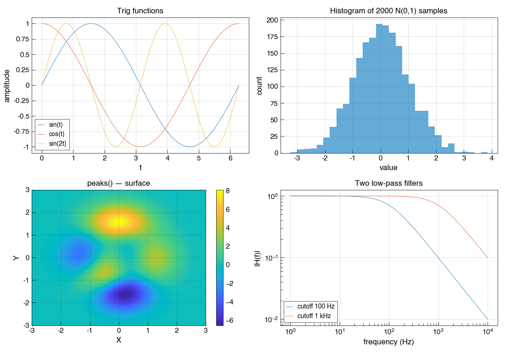

# openlab-style

> Matplotlib styling that makes your plots look like MATLAB. Drop-in for AI workflows.

## Why

AI assistants (ChatGPT, Claude, Cursor) generate Python + matplotlib for technical computing. But if you're a MATLAB user — a student turning in homework, a researcher collaborating with MATLAB-using labs, an engineer maintaining MATLAB code — matplotlib's output visually screams "not MATLAB." Different colormap. Different fonts. Different line colors. Different axes style.

`openlab-style` fixes that with a one-liner. Your AI keeps writing Python; your plots come out looking like MATLAB R2014b+.

## Install

```bash
pip install openlab-style
```

## Use

```python
import openlab_style
openlab_style.apply()

# ... matplotlib code now produces MATLAB-styled output
import matplotlib.pyplot as plt
import numpy as np

t = np.linspace(0, 2*np.pi, 200)
plt.plot(t, np.sin(t), t, np.cos(t), t, np.sin(2*t))
plt.legend(['sin(t)', 'cos(t)', 'sin(2t)'])
plt.title('Trig functions')
plt.xlabel('t'); plt.ylabel('amplitude')
plt.grid(True)
plt.show()
```

That's it. Two lines of setup.

## What it looks like



That's matplotlib with `openlab_style.apply(grid=True)` — same engine your AI is already using, but the output now reads as MATLAB. Lines palette, parula colormap, full axes box, inward ticks, dotted grid, histogram bars with edges, minor ticks on log axes.

## Use it in ChatGPT Code Interpreter

ChatGPT Code Interpreter (Advanced Data Analysis) lets you `pip install` arbitrary packages. So:

> Use openlab-style for matplotlib so plots look like MATLAB. Install it first, then plot a damped oscillator from 0 to 10 seconds.

ChatGPT will run:

```python
!pip install openlab-style
import openlab_style; openlab_style.apply(grid=True)
# ...your plot here...
```

And the resulting figure will look like it came out of MATLAB.

The same trick works in Claude (when given Python execution via MCP, code_execution beta, or a Python sandbox), in Jupyter, in Colab, anywhere `pip install` runs.

## API

### `openlab_style.apply(*, grid=False, fontsize=10)`

Apply MATLAB-style defaults to matplotlib. Mutates global `rcParams`. Idempotent.

- `grid`: Turn the grid on by default. MATLAB's default is `grid off`; many users prefer `on`. Default `False`.
- `fontsize`: Base font size. MATLAB default is 10pt.

### `openlab_style.reset()`

Reset matplotlib to factory defaults.

### `openlab_style.MATLAB_LINES`

The 7-color MATLAB lines palette as a list of RGB tuples.

### `openlab_style.MATLAB_LINES_HEX`

Same palette as hex strings: `["#0072BD", "#D95319", "#EDB120", "#7E2F8E", "#77AC30", "#4DBEEE", "#A2142F"]`.

### `openlab_style.parula_cmap()`

Returns MATLAB's `parula` colormap as a matplotlib `ListedColormap`. Useful if you want `parula` without applying the rest of the style:

```python
import matplotlib.pyplot as plt
from openlab_style import parula_cmap
plt.imshow(data, cmap=parula_cmap())
```

`apply()` registers `parula` with matplotlib's global colormap registry, so once called you can also just use `cmap='parula'` everywhere.

## What this doesn't do

- It doesn't make your Python *behave* like MATLAB (matrix math, indexing, broadcasting differ).
- It doesn't translate MATLAB syntax to NumPy.
- It doesn't run actual MATLAB code.

For those use cases (run real MATLAB code via AI tools, get true MATLAB semantics for `bode`/`tf`/`eig` etc.), see the sister project: **[openlab](https://github.com/nxcodeio/openlab)** — an MCP server that exposes real Octave to Claude, Cursor, and other AI tools.

The two projects are complementary:

| You need... | Use |
|-------------|-----|
| AI's matplotlib plots to *look* like MATLAB | `openlab-style` (this package) |
| AI to run actual MATLAB code (`bode`, `tf`, real Octave semantics) | [openlab](https://github.com/nxcodeio/openlab) (MCP server) |

## Compatibility

- Python ≥ 3.9
- matplotlib ≥ 3.5
- Tested with matplotlib 3.10
- No native code, no compilation. Pure Python.

## Develop

```bash
git clone https://github.com/nxcodeio/openlab-style.git
cd openlab-style
python -m venv .venv
source .venv/bin/activate
pip install -e ".[dev]"
pytest
python examples/render_demo.py
```

## License

MIT. See [LICENSE](LICENSE).

## Acknowledgments

- MATLAB's `lines` palette and `parula` colormap are from MathWorks; the RGB values are public reference data that has been independently reproduced across the open source ecosystem for years.
- Inspired by the practical problem of getting AI-generated matplotlib output to fit MATLAB-shaped workflows.
